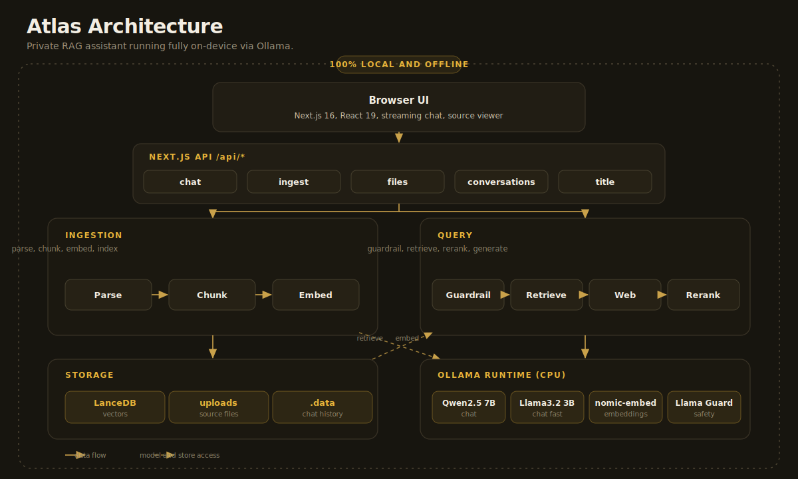

# Atlas

A private AI assistant with retrieval augmented generation that runs entirely on your machine. Chat with your own documents, search the web, and keep every byte local. No cloud, no API keys.

  

## Features

- Streaming chat powered by local models through Ollama.
- Retrieval augmented generation over your own PDF, DOCX, image, TXT, and Markdown files.
- OCR for scanned PDFs and images, so picture only documents become searchable.
- Multi query expansion that rewrites a question into several searches for better recall.
- Per query router that decides whether a question needs your documents, the web, or neither.
- Hybrid reranking that fuses vector similarity with BM25 keyword scoring.
- Document scoping to focus answers on a chosen subset of your library.
- Tool calling for math, the current time, and fetching a web page.
- Keyless web search through DuckDuckGo or a self hosted SearXNG instance.
- Source viewer that opens the original page and highlights the cited passage.
- Voice input and read aloud output using the browser speech APIs.
- Safety guardrail backed by Llama Guard 3, with a fast rule based pre filter.
- Conversation history with automatic titles, full text search, and Markdown export.
- Code blocks with syntax highlighting and a copy button.
- App lock with a PIN, settings that persist, and model keep alive for a fast first token.

## Architecture



The browser talks to Next.js route handlers. Ingestion parses a file, splits it into chunks, embeds them, and writes vectors to LanceDB. A query passes the guardrail, retrieves matching chunks and optional web results, reranks them, builds grounded context, and streams the answer from Ollama. Everything stays on the device.

## Requirements

- Node.js 20 or newer.
- Ollama installed and running, with these models pulled:

```bash
ollama pull llama3.2:3b
ollama pull qwen2.5:7b-instruct
ollama pull nomic-embed-text
ollama pull llama-guard3:1b
```

Without `llama-guard3:1b` the guardrail falls back to the rule based pre filter.

## Quick start

```bash
npm install
npm run dev
```

Open http://localhost:3000, upload a document from the Library tab, then ask a question. Each answer lists the sources it used.

## Configuration

Settings live in `.env.local`.

| Variable | Default | Description |
| --- | --- | --- |
| `CHAT_MODEL` | `qwen2.5:7b-instruct` | High quality chat model |
| `CHAT_MODEL_FAST` | `llama3.2:3b` | Default chat model, fast on CPU |
| `GUARD_MODEL` | `llama-guard3:1b` | Safety moderation model |
| `GUARD_BLOCK` | `S1,S2,S3,S4,S9,S10,S11,S12,S14` | Llama Guard categories that block a request |
| `EMBED_MODEL` | `nomic-embed-text` | Embedding model, 768 dimensions |
| `RAG_TOP_K` | `4` | Number of chunks retrieved |
| `RAG_CHUNK_SIZE` | `900` | Chunk size in characters |
| `RAG_CHUNK_OVERLAP` | `120` | Overlap between chunks |
| `OLLAMA_KEEP_ALIVE` | `30m` | How long Ollama keeps models resident |
| `HISTORY_BUDGET` | `8000` | Character budget for chat history sent to the model |
| `SEARXNG_URL` | empty | Optional SearXNG endpoint for the most reliable web search |

Web search uses DuckDuckGo by default and needs internet access. If your network blocks DuckDuckGo, run a local SearXNG instance and set `SEARXNG_URL`.

OCR uses bundled language data in `tessdata` when present (fully offline). Add `eng.traineddata.gz` and `ind.traineddata.gz` there from the Tesseract data repository, or let the first OCR download them once. App lock, voice, and persisted settings live in the browser.

## Project structure

```
app/
  api/chat            streaming chat with routing, RAG, web, tools, and guardrail
  api/ingest          upload, parse, OCR, chunk, embed, and index
  api/documents       list and delete documents
  api/conversations   save, load, and delete chat history
  api/files/[id]      serve the original file for the source viewer
  api/search          full text search across conversations
  api/title           generate a short conversation title
  api/warmup          preload models for a fast first token
  page.tsx            main interface
lib/
  rag/                parse, ocr, chunk, embeddings, vectorstore, ingest, retrieve, rerank, expand, files
  websearch.ts        keyless web search with SearXNG and DuckDuckGo backends
  router.ts           per query source routing
  tools.ts            calculator, datetime, and url fetch tools
  guardrail.ts        Llama Guard moderation with a rule based pre filter
  history.ts          chat history trimming
  store.ts            conversation persistence and search
  voice.ts            speech input and output
  lock.ts             local PIN lock
  ollama.ts           Ollama provider
  config.ts           central configuration
components/           Sidebar, Composer, MessageBubble, Markdown, Sources, SourceViewer, LockScreen, Brandmark
```

## Privacy

Atlas runs every model locally through Ollama. Documents, embeddings, and chat history are written only to your disk under `uploads`, `.lancedb`, and `.data`, all of which are excluded from version control.
